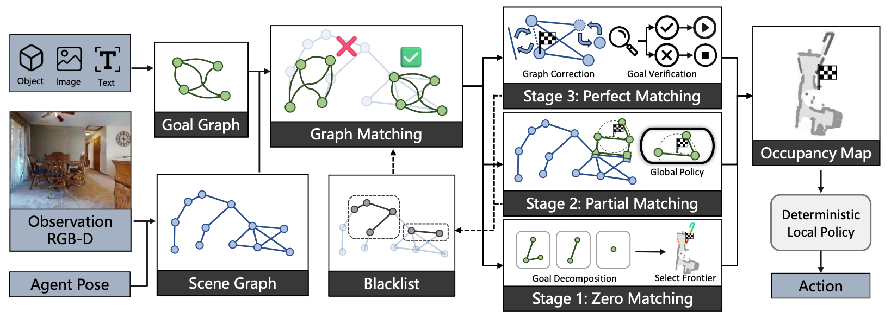

# UniGoal: Navigate to Any Goal in Zero-shot!
### [Paper](https://arxiv.org/abs/2503.10630) | [Project Page](https://bagh2178.github.io/UniGoal/) | [Video](https://cloud.tsinghua.edu.cn/f/d929f1c073d44ba39d91/?dl=1) | [中文解读](https://zhuanlan.zhihu.com/p/30973430092)

> UniGoal: Towards Universal Zero-shot Goal-oriented Navigation  
> [Hang Yin](https://bagh2178.github.io/)*, [Xiuwei Xu](https://xuxw98.github.io/)\* $^\dagger$, [Linqing Zhao](https://lqzhao.github.io/), [Ziwei Wang](https://ziweiwangthu.github.io/), [Jie Zhou](https://scholar.google.com/citations?user=6a79aPwAAAAJ&hl=en&authuser=1), [Jiwen Lu](http://ivg.au.tsinghua.edu.cn/Jiwen_Lu/)$^\ddagger$  

\* Equal contribution $\dagger$ Project leader $\ddagger$ Corresponding author

We propose a <b>unified</b> graph representation for <b>zero-shot</b> goal-oriented navigation. Our method can be directly applied to different kinds of scenes and goals <b>without training</b>.

## News
- [2025/05/13]: Fix bugs on environment installation and inference. Object-goal will be supported in two weeks.
- [2025/04/06]: Release code. Now instance-image-goal and text-goal are supported.
- [2025/03/08]: Initial update. We are working for ICCV now. Arxiv and code will be released within two weeks.
- [2025/02/27]: UniGoal is accepted to CVPR 2025!

## Demo
### Real-world Deployment:


### Simulation Environment:


Demos are a little bit large; please wait a moment to load them. Welcome to the home page for more complete demos and detailed introductions.

## Method 

Method Pipeline:


## Installation

**Step 1 (Environment)**

Clone UniGoal.
```
git clone https://github.com/bagh2178/UniGoal.git
cd UniGoal
```

Create environment.
```
conda create -n unigoal python==3.8
conda activate unigoal
```

Install habitat-sim==0.2.3 and habitat-lab==0.2.3.
```
conda install habitat-sim==0.2.3 -c conda-forge -c aihabitat
pip install -e third_party/habitat-lab
```

Install third party packages.
```
pip install git+https://github.com/cvg/LightGlue.git
pip install git+https://github.com/facebookresearch/detectron2.git
pip install git+https://github.com/facebookresearch/pytorch3d.git
git clone https://github.com/IDEA-Research/Grounded-Segment-Anything.git third_party/Grounded-Segment-Anything
cd third_party/Grounded-Segment-Anything
git checkout 5cb813f
pip install -e segment_anything
pip install --no-build-isolation -e GroundingDINO
cd ../../
mkdir -p data/models/
wget -O data/models/sam_vit_h_4b8939.pth https://dl.fbaipublicfiles.com/segment_anything/sam_vit_h_4b8939.pth
wget -O data/models/groundingdino_swint_ogc.pth https://github.com/IDEA-Research/GroundingDINO/releases/download/v0.1.0-alpha/groundingdino_swint_ogc.pth
```

Install other packages.
```
conda install pytorch::faiss-gpu
pip install -r requirements.txt
```

**Step 2 (Dataset)**

Download HM3D **scene** dataset from [here](https://api.matterport.com/resources/habitat/hm3d-val-habitat-v0.2.tar).

Download **instance-image-goal** navigation episodes dataset from [here](https://dl.fbaipublicfiles.com/habitat/data/datasets/imagenav/hm3d/v3/instance_imagenav_hm3d_v3.zip).

Download **text-goal** navigation episodes dataset from [here](https://drive.google.com/uc?export=download&id=1KNdv6isX1FDZi4KCVPiECYDxijg9cZ3L).

The structure of the dataset is outlined as follows:
```
UniGoal/
└── data/
    ├── datasets/
    │   ├── textnav/
    │   │   └── val/
    │   │       └── val_text.json.gz
    │   └── instance_imagenav/
    │       └── hm3d/
    │           └── v3/
    │               └── val/
    │                   ├── content/
    │                   │   ├── 4ok3usBNeis.json.gz
    │                   │   ├── 5cdEh9F2hJL.json.gz
    │                   │   ├── ...
    │                   │   └── zt1RVoi7PcG.json.gz
    │                   └── val.json.gz
    └── scene_datasets/
        └── hm3d_v0.2/
            └── val/
                ├── 00800-TEEsavR23oF/
                │   ├── TEEsavR23oF.basis.glb
                │   └── TEEsavR23oF.basis.navmesh
                ├── 00801-HaxA7YrQdEC/
                ├── ...
                └── 00899-58NLZxWBSpk/
```

**Step 3 (LLM and VLM)**

Option 1: Install Ollama.
```
curl -fsSL https://ollama.com/install.sh | sh
ollama pull llama3.2-vision
```

Option 2: Use LLM and VLM via your own API. Change the `llm_model`, `vlm_model`, `api_key`, `base_url` in the configuration file `configs/config_habitat.yaml` to your own.

## Evaluation

Run UniGoal on benchmarks:
```
python main.py --goal_type ins-image  # instance-image-goal
python main.py --goal_type text # text-goal
```

## Inference

Run UniGoal on the user-specified episode and goal:
```
python main.py --goal_type ins-image [--episode_id <episode_id>] [--goal "path/to/image.png"]  # or .jpg
python main.py --goal_type text [--episode_id <episode_id>] [--goal "The chair is white, with a ..."]
```

## Real-world

In `src/envs/real_world_env.py`, the functions `step`, `get_observation`, `get_agent_pose` should be implemented.
Run UniGoal in real-world environment:
```
python main.py --goal_type <goal_type> --goal <goal> --real_world
```

## Code Structure

Core:

- **`main.py`**: Entrance for running UniGoal.
- **`src/agent/`**:
  - **`unigoal/agent.py`**: Interface of UniGoal agent which gets the observation and generates and conducts the low-level actions.
- **`src/graph/`**:
  - **`graph.py`**: The implementation of goal graph and scene graph.
  - **`goalgraphdecomposer.py`**: The implementation of the decomposer of graphs.
  - **`graphbuilder.py`**: The implementation of the builder of graphs.
- **`src/map/`**:
  - **`bev_mapping.py`**: The implementation of occupancy map.

Environment:

- **`src/envs/`**:
  - **`habitat/instanceimagegoal_env.py`**: Wrapper of habitat env to deploy goal-orineted navigation tasks.
- **`src/utils/`**:
  - **`fmm`**: Implementation of Fast Marching Method (FMM).
  - **`visualization/`**: Visualizer of UniGoal.
  - **`camera.py`**: Camera parameters.
  - **`llm.py`**: Wrapper of LLM and VLM.
  - **`map.py`**: Utility functions of bev mapping.
  - **`model.py`**: Some models of FMM.
- **`configs/`**: Configuration files of UniGoal.

## Citation
```
@article{yin2025unigoal, 
      title={UniGoal: Towards Universal Zero-shot Goal-oriented Navigation}, 
      author={Hang Yin and Xiuwei Xu and Linqing Zhao and Ziwei Wang and Jie Zhou and Jiwen Lu},
      journal={arXiv preprint arXiv:2503.10630},
      year={2025}
}
```